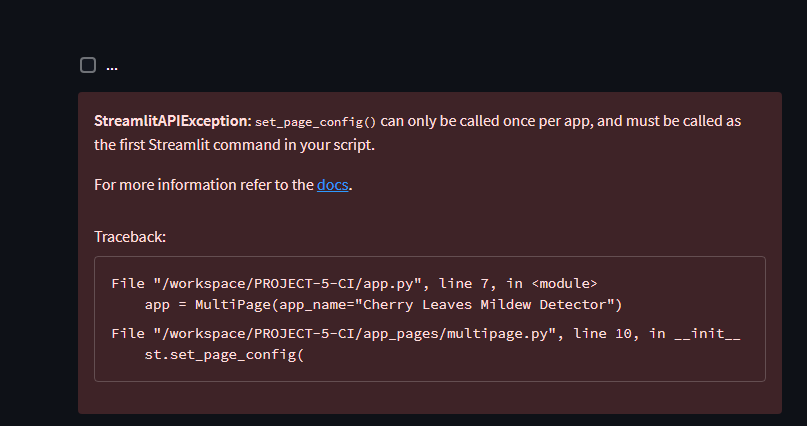

# Cherry Leaf Mildew Detector Prototype

## Dataset Content

This dataset contains 2104 images of cherry leaves. The photos show healthy leaves and leaves with mildew

## Requirements

The client is the head of IT and Innovation at Farmy & Foods, a company in the agricultural sector that produces and harvests different types of food.  is requesting a dataset that:

1. Visualize the difference between a healthy leaf from a leaf that contains powdery mildew.
2. Also, that predicts if a cherry tree is healthy or has powdery mildew.

## How to validate?

In order to differentiate between a healthy leaf and a leaf with mildew can be done with a simple image study.

## Dashboard Design (Streamlit UI)

### Page 1: Summary

* Quick Project Summary
* General information:
  * Powdery mildew, is a fungal disease that affects a wide range of plants.
  * The company is concerned about supplying the market with a product of compromised quality.
  * Currently, the process is to manually verify if a given cherry tree contains powdery mildew. An employee spends around 30 minutes in each tree.
  * To save time in this process, the IT team suggested an ML system that is capable of detecting instantly, using a tree leaf image, if it is healthy or has powdery mildew.
* Project Dataset:
  * The available dataset contains 2104 images of cherry leaves
* Business Requirements
  * The client is:
    * is interested in conducting a study to visually differentiate a cherry leaf that is healthy from one that contains powdery mildew.
    * is interested in predicting if a cherry tree is healthy or contains powdery mildew.

#### Bugs

* Data is not displaying on the pages
   * 
     * Haven't found a solution to this error 
* Failing to deploy
  * .png)  
    * Haven't fixed this issue

#### Credit

* This prototype was created following Code Institutes Walkthrough Project 01 for Data Analysis & Machine Learning Toolkit
